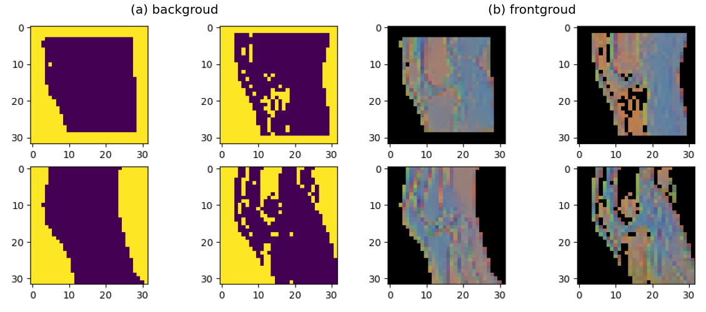

# DINO mask
This method was using the pretrained DINO v2 to help creating a mask for the image. As it was explained in the DINO v2 part, this model could help us output the normalized patch token values directly. After using the PCA package from the sk-learn, the patch values could be grouped directly into 3 groups, after setting the threshold of the background value, it would let the background become all zero (Figure 24 showed 4 examples by using DINO v2 as mask). They also used this tech in their paper to separate their object from the original image [36] and achieved a really nice result. After using the mask, we could then forced the MaxViT model not to look at the bounder's pixels, only focused on the front object.

  

