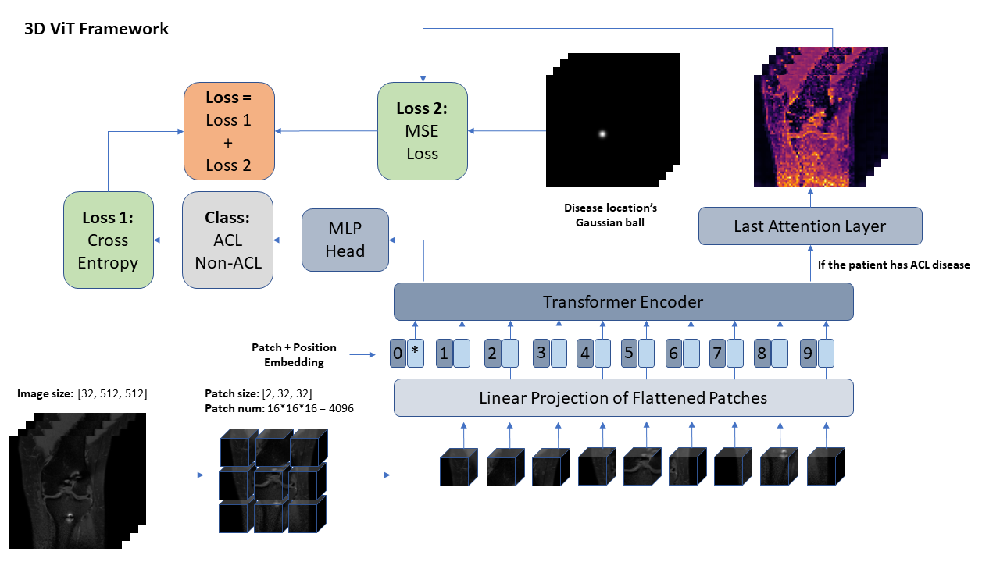

# Framework
A 3D vision transformers needed to be designed based on the usual ViT structure to fulfil our task. Wang et al. [37] built a special 3D conv-transformers model on the knee MRIs as I introduced before but the problem in their model was because they used the convolutional layer at first, the attention layer couldn't output the model's attention on original image anymore, which would make the location of diseases become useless. The new structure was similar with the 2D version but the patches were all with 3D shape so that it would cut the 3D MRIs into small 3D patches, gave each of them a positional embedding and input them into the transformer encoder. From the MLP we extract the features to regress to the diseases. If the patient had the labels of coordinates (meant this patient had that disease), would lead to the second loss part, used the attention layer to compared with the coordinates' ground truth. Since this one was not the segmentation task, the solid circle was changed into a gaussian ball with the help of the package TorchIO. (Figure 17) Because the specific shape of the disease was not important, as long as the attention of ViT could focus on the surrounding area of the disease, the closer to the centre, the better. If the patient didn't have this kind of disease, then the model would skip the second loss.

  

