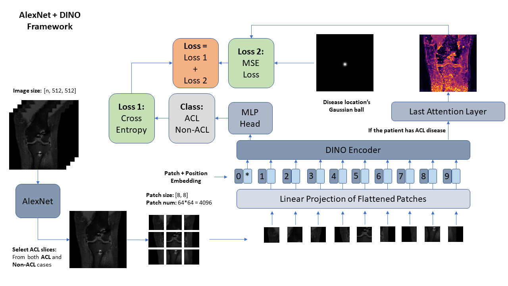
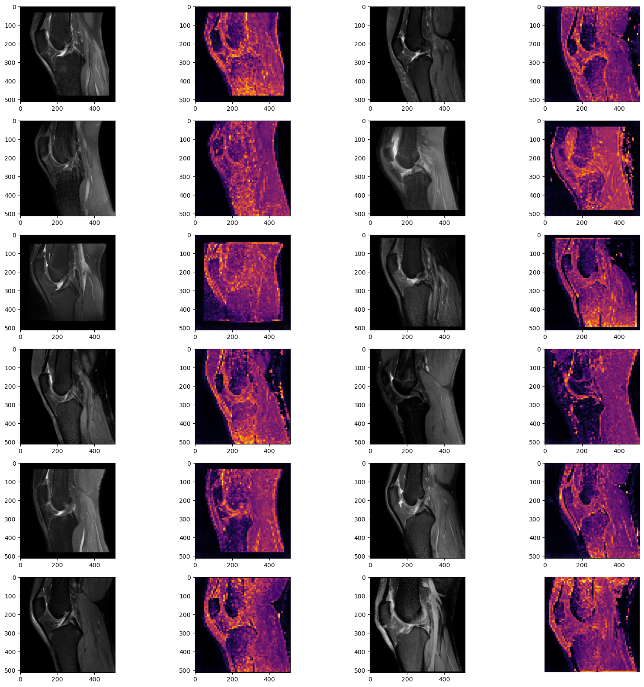
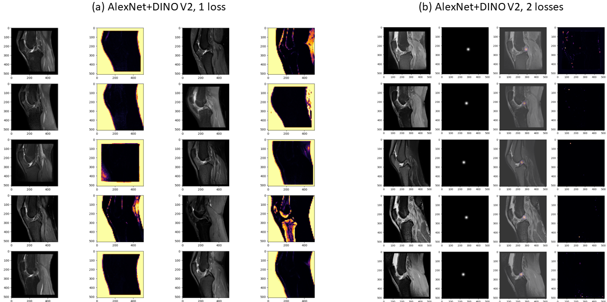

# Framework
This structure was based on the paper from Liu et al., As it was introduced before, they used a combination of the LeNet, YOLO and DenseNet. Since the AlexNet had been proved that it had a promising result in detecting the knee diseases [15]. I replaced the LeNet with AlexNet to help us to select the slices with ACL disease because it had a nice diseasedetection result in baseline method. But since if all the images input were with ACL disease then it was impossible for DINO v2 to see the difference between the ACL and non-ACL cases. But we only had the ACL location in the ACL cases, so the traininig AlexNet model was used to help us also select the slice which might have ACL as well in the non-ACL cases. After inputting into the DINO v2 model, we still use the same structure with the previous 3D ViTs: extracting features from MLP layer and used that to do a classification task, if this case had this kind of disease, using the attention layer to help us locate the disease position, compared that with the gaussian ball label (Figure 21 was the frame work).

  

# Selected ACL slices with DINO
The left columns were the selected ACL slices by AlexNet as the first step, the right columns were the attention layer after inputting inside the pretrained (only pretrained on the ImageNet not on the private dataset) DINO v2 model.

  

# Attention layer, 1 loss compared with 2 losses

  

