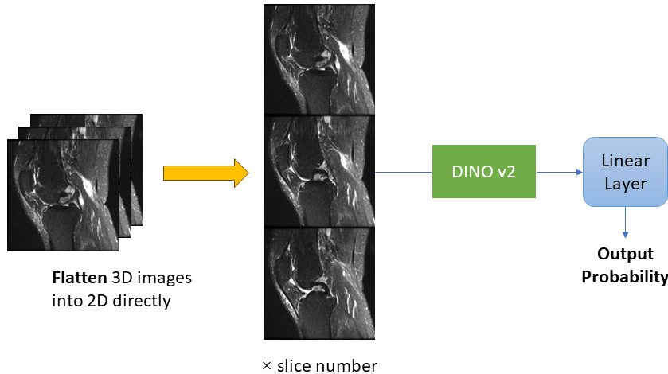

# Framework
It was designed to solve the previous problem: different batch of 2D images didn't have communication between each other. Every 3D MRI was flattened into one long image. Since the vision transformers' positional encoding was first cutting the rows into small patches, after one row was finished, cutting a new row below. This stacking method’s design equalled to a 3D ViTs but with patches' depth equalled to 1 (from the results of positional encoding, they were the same). Also thanked to the design of DINO v2, usually transformers

  

