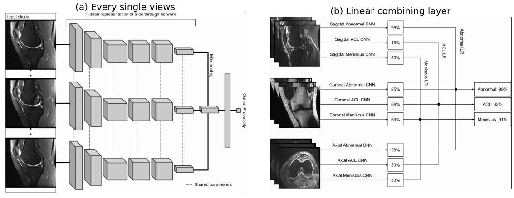

# Basic structure

## dataset
This file is used to reading read the images and labels from the dataset.

## model
In this model file, I put 4 different models inside and do comparison. The baseline method AlexNet, MaxViT, DINO and DINO v2.

The main structure was based on the design of baseline method, first use a model to extract features from the MRIs, then use the max pooling layer to extract from the features, at last using a linear layer to regress the final results.

The following image was the baseline structure:

  

## train_models
This file includes the setting of learning rate, loss function, optimizer, cross-validation and other basic settings. I set the patience equals to 5 so that if the validation loss didn't keep reducing from 5 iterations, the model will stop automatically.
