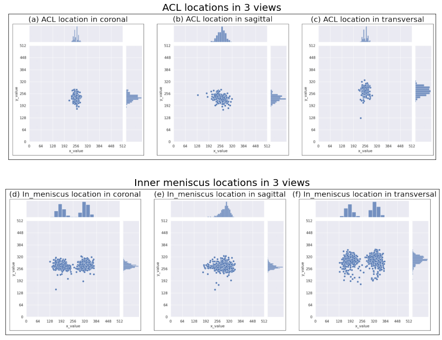

# Framework
The method was using the location of diseases. Since MaxViT was a complex ViT model and because of the limitation of graphic card, it was necessary to smaller the image size from (n,512,512) to (n,256,256). One method was to use the interpolation to smaller the images directly, but if a crop was made around the location, the result might be better compared with the zoom. This method had been proved by Kara et al. [41], their mask setting was like this Figure 10.

In the transformers, mask would also waste the computation during training, and the goal was to make the original images become smaller. Since the coordinates of diseases were the labels, it was possible to skip the part of manually selecting area. The grouped diseases we used were ACL, PCL and meniscus, so the location was always close to the central of the whole image, which also helped us to do the cropping. Because different cases had diseases on different depth, so only the x and y direction coordinates were token to let all the positions projected onto the x-y plane. From Figure 23 we could see that clearly, in the sagittal view, the location of ACL and meniscus was always in the central. Although it was possible that in some

  

