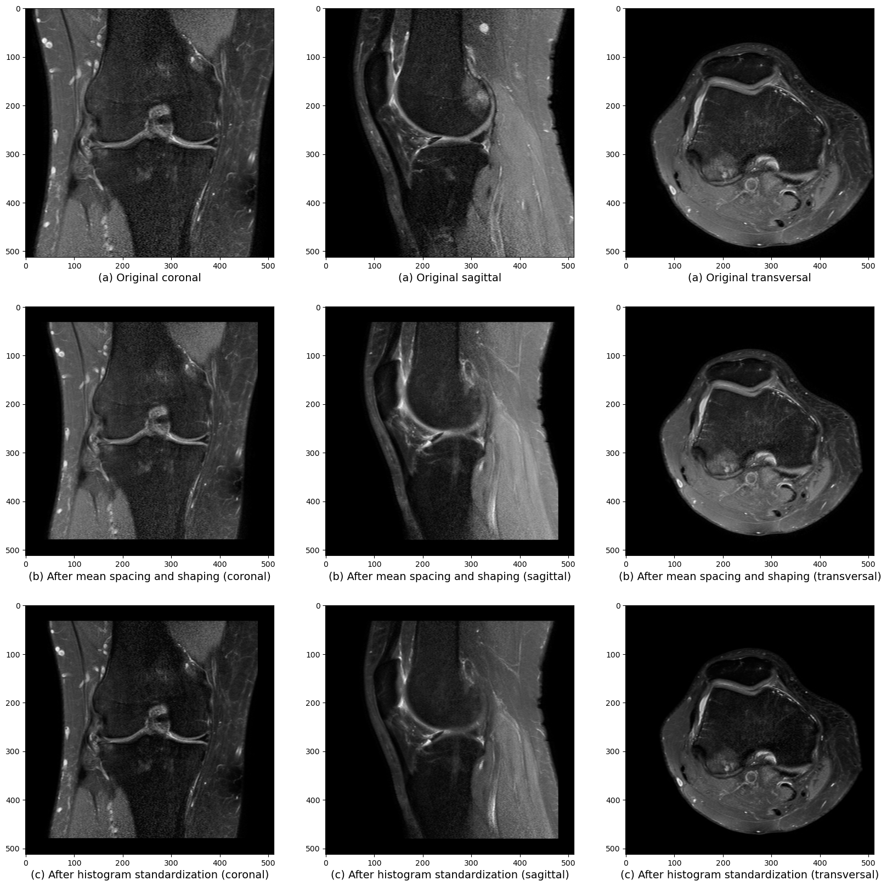
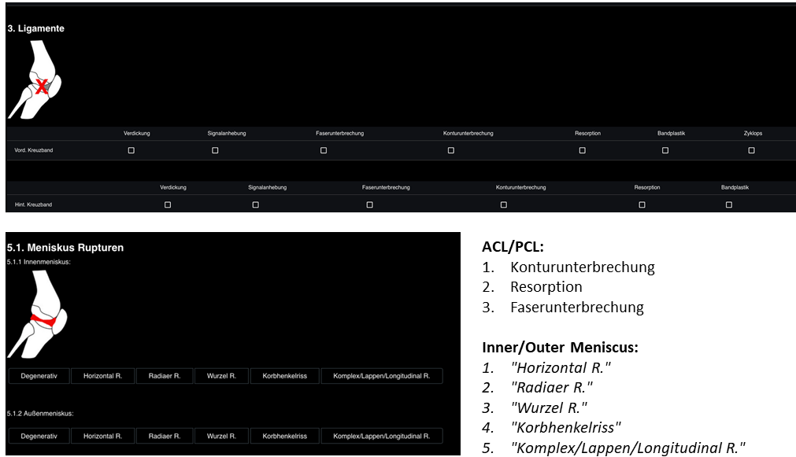

# Preprocess of Dataset

## Preprocess of images
A python package called TorchIO was used to facilitate the preprocessing stage. TorchIO is an open-source library specifically designed for efficient loading, preprocessing, augmentation and patch-based sampling of 3D medical images in deep learning, following the design principles of PyTorch. The whole process could be seen in the preprocess file.

### 1. Calculate the mean spacing
Since the sequences of the MRIs were unknown, it was possible that the spacing between pixels varied across the dataset. This variability in spacing could pose challenged when directly inputting the original dataset into the model. Upon investigation, it was discovered that some cases had more than 200 slices, while the average number of slices was around 30. This significant difference in the number of slices created a memory overload on CUDA platform each time the model was trained. (The table below was the mean spacing of every view of Praxis dataset)

|Views|X-direction|Y-direction|Z-direction|
| --- | --- | --- | --- |
|Coronal|0.358|0.358|3.727|
|Sagittal|0.357|0.357|3.632|
|Transversal|0.343|0.343|3.990|

### 2. Calculate the mean shaping
The second part was the mean shape and crop. Once the mean pixel spacing was calculated, the aim was to ensure that the spacing across all  cases was consistent. By replacing each case's spacing with the mean spacing got from the previous table, TorchIO would use linear interpolation (linear interpolated image intensity at a non-integer pixel position) to adjust the shape of the image, so that during the further training, the knees from each case would have similar size. This also balanced the preservation of important information while ensuring ease ubout into the model. The following table was the mean image shape after the previous step.

|Views|X-direction|Y-direction|Z-direction|
| --- | --- | --- | --- |
|Coronal|522.08|522.07|24.9|
|Sagittal|521.71|521.69|24.92|
|Transversal|519.34|519.34|27.14|

Here I choose the images have a shape of 512*512 for x-direction and y-direction, but for the z-direction, they still keep their slice number in order to not losing any details from images.

### 3. Histogram standardization
The last part was to do the histogram standardization. As each case in the dataset could originate from different sequences, it was crucial to normalize the pixel values within each image. The objective was to ensure that all images exhibited a similar appearance, regardless of their source sequence. To achieve this, a technique called histogram standardization was employed. The process involved training landmark values from each case and calculating their mean value. By applying this mean value to each image, it was able to adjust the pixel values and create a consistent visual representation across all cases. This histogram standardization step was essential in harmonizing the pixel intensities, making the images more comparable and facilitating subsequent analysis.

The following image was the performance from the previous steps.

  

## Preprocess of labels
There were 7 different 'projectName's, and some cases had several different labels under different projects. Here we only used 4 grouped diseases for training, ACL, PCL ,inner-meniscus and outer-meniscus. The methods about how to read the json file to extract labels were shown in the ipynb file.

The following image was the performance from the previous steps.

  

