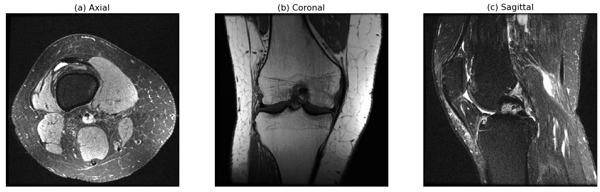

# Preprocess of Dataset
## Proprocess of images
### 1. Calculate the mean spacing
A python package called TorchIO was used to facilitate the preprocessing stage. TorchIO is an open-source library specifically designed for efficient loading, preprocessing, augmentation and patch-based sampling of 3D medical images in deep learning

  

