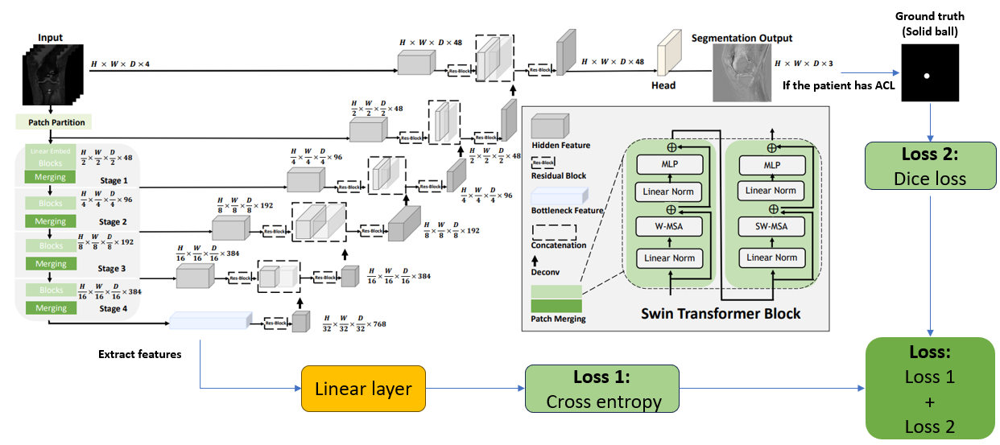

# Framework
Previous work at the institute showed promising results in femur positioning with changing the coordinate labels into several small solid balls and passed the model nnU-net [43], which was also a well-known segmentation model for medical use. Swin Unet-R was also based on the Unet structure, I made another model based on it, which outputted the prediction of disease and segmentation result at the same time. For the label, I used the location of coordinates to made some solid round flakes on 3 slices as the depth (here was the improved Swin Unet-R’s framework)

  

