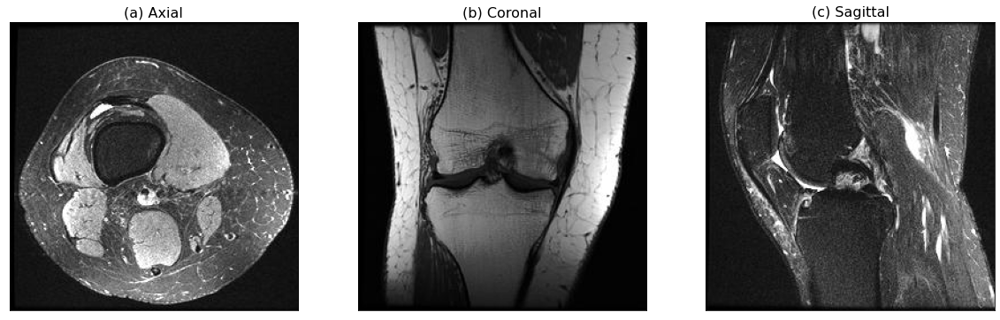

# Knee MRI Classification & Location
This is my master thesis project. We aim to use the vision transformers to classify different diseases in knee MRIs and use the attension inside to locate the disease position.

## Dataset
Two different datasets were used in this project:
### MRNet
**MRNet** was a famous public dataset which was made by Standford University. It consists of 1370 knee MRI with 1104 (80.6%) **abnormal** cases, 319 (23.3%) **ACL** tears and 508 (37.1%) **meniscal** tears. Each case has 3 different sides which is also the same with the private dataset.

  

### Praxis
The private dataset Praxis has a really similar structure compared with the MRNet. Each case within Praxis consists of three distinct views: coronal, sagittal, and transversal. However, in stark contrast to the MRNet dataset, Praxis boasts a significantly larger number of cases, totally 3794. Moreover, the labels associated with Praxis differ substantially from those of the MRNet dataset. In Praxis, the labels provide detailed information in the form of coordinates for numerous diseases.

Praxis had an old label from 2 years before, that one only had 0 or 1 labels similar with the MRNet dataset. Some diseases on the old label and the new label were the same, so they could be compared with each other, for example the most common disease: ACL and meniscus. But some diseases didn't match up with each other some of the cases. Combined with the latest label got from radiologists in May, 4 different versions of labels were made for the following training:
1. label 1: The label from 2 years ago, only had 0 or 1,  
2. label 2: The label extracted from the first json file,
3. label 3: The overlap cases on ACL and meniscus from label 1 and label 2,
4. label 4: The latest label received at the end of May from the radiologists’ group.

The disease distribution in Praxis:
|Label number (cases)|ACL|PCL|Inner Meniscus|Outer Meniscus|
| --- | --- | --- | --- | --- |
|Label 1 (3794)|ACL: 251(6.62%)||Menicus: 1300 (34.26%)||
|Label 2 (3511)|218 (6.24%)|17 (0.48%)|1015 (28.91%)|309 (8.80%)|
|Label 3 (3317)|180 (5.43%)|16 (0.48%)|943 (28.43%)|286 (8.62%)|
|Label 4 (3503)|211 (6.03%)|16 (0.48%)|933 (26.62%)|281 (8.02%)|

## Methods with Results
According to the baseline method, every single disease had a separate trained model. This would take a lot of time, for example in the MRNet dataset, there were 3 different views and 3 diseases, so 9 models had to be trained to get all the diseases' AUC on every views. Since simply change the last linear layer inside the model could make it output 3 values together. Here was a comparison between using the 1 output and 3 outputs with MaxViT on MRNet dataset. The abnormal and meniscus had similar results, but the AUC of ACL had a small improvement. It could prove that had 3 outputs at the same time wouldn't affect the performance of model. In order to saving time, all of the other models were also designed to output the diseases values together.

|Methods|Views|Abnormal|ACL|Meniscus|
| --- | --- | --- | --- | --- |
|MaxViT with 1 output|Axial|0.924|0.885|0.806|
||Sagittal|**0.949**|0.883|0.801|
||Coronal|0.865|0.865|**0.833**|
|MaxViT with 3 outputs|Axial|0.930|0.900|0.816|
||Sagittal|0.945|0.903|0.782|
||Coronal|0.902|**0.931**|0.823|

Here were the results from different methods trained on MRNet dataset:

|Methods|Views|Abnormal|ACL|Meniscus|
| --- | --- | --- | --- | --- |
|Baseline|Axial|0.921|0.883|0.778|
||Sagittal|0.929|0.860|0.766|
||Coronal|0.802|0.804|0.788|
|ResNet+spatial attention|Multi-Planes|0.923|0.928|0.784|
|DINO v2+baseline|Sagittal|0.659|0.590|0.626|
|Swin Unet-R|Axial|0.848|0.707|0.755|
||Sagittal|0.884|0.774|0.688|
||Coronal|0.613|0.469|0.630|
|MaxViT|Axial|0.930|0.900|0.816|
||Sagittal|0.945|0.903|0.782|
||Coronal|0.902|**0.931**|**0.823**|
|MaxViT+spatial attention|Sagittal|**0.951**|0.909|0.788|
|MaxViT+DINO mask|Sagittal|0.942|0.905|0.788|

Results of Swin Unet-R are shown in Table 6, we used Praxis with the label 3. Here was a comparison between whether using the second loss in segmentation part, only ACL was trained here. And in Figure 25 was the result of location regression, left columns were the ground truth of diseases’ location and right columns were the coordinates’ predictions.
|Method|ACL|
| --- | --- |
|Swin Unet-R (1 loss)|0.550|
|Swin Unet-R (2 losses)|0.573|

Results of the 3D vision transformers which was trained on Praxis was shown in the following table, here was a comparison between whether the second loss was used on the attention layer and which attention layer was been trained. These 3 models were trained on label 4, because the latest label 4 was just received when training this model. But here it is mainly needed to observe whether using loss 2 will improve the classification performance of transformers, and decide which attention layer should be used to train is more reasonable:
|Method|ACL|
| --- | --- |
|3D ViT (1 loss)|0.522|
|3D ViT (2 losses, with first attention layer)|0.534|
|3D ViT (2 losses, with last attention layer)|**0.575**|

The following table was the results from the DINO v2 (Praxis label 3), the first one with baseline structure was only replace the AlexNet in baseline method with DINO v2, second one was to flat input 3D images as a huge 2D rectangle image, third and fourth was using AlexNet at first to select ACL images then do the comparison whether adding second loss on last attention layer:
|Method|ACL|PCL|Inner-Meniscus|Outer-Meniscus|
| --- | --- | --- | --- | --- |
|With baseline structure|0.550|**0.637**|**0.578**|**0.562**|
|With flatten|0.571|0.618|0.566|0.561|
|With AlexNet (1 loss)|0.565||||
|With AlexNet (2 losses)|**0.612**||||

The following table was the results trained on Praxis dataset, with the label 3. Zoom meant using the zoom package to interpolate the original images from 512 to 256, crop meant using a crop based on the location of diseases which also made the original image from 512 to 256.
|Method|ACL|PCL|Inner-Meniscus|Outer-Meniscus|
| --- | --- | --- | --- | --- |
|Baseline (Original)|**0.827**|0.609|**0.813**|**0.742**|
|ResNet+Spatial (Original)|0.707|0.791|0.637|0.626|
|Baseline (Zoom)|**0.773**|0.573|0.753|0.641|
|MaxViT (Zoom)|0.769|0.637|**0.755**|**0.676**|
|MaxViT (Crop)|0.668|0.643|0.691|0.664|
|MaxViT with spatial (crop)|0.629|**0.791**|0.672|0.626|

